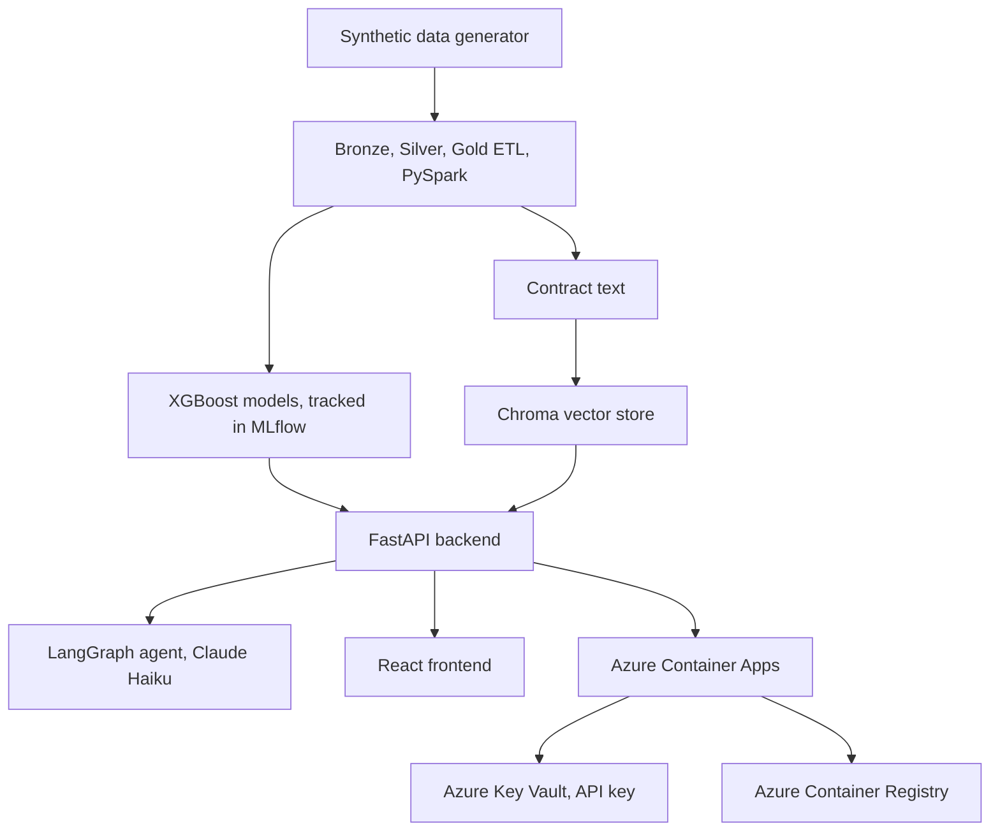

# FinePrint

A contract and invoice risk platform built as a portfolio project to demonstrate an end-to-end data, machine learning, RAG, agent and cloud deployment workflow.

It predicts payment delay risk on invoices and clause risk on contracts and lets you ask questions about your documents through a chat agent that grounds its answers in real predictions.

This is a prototype built to show the pipeline and technical skills behind it working end to end, not a finished product. It comes pre-loaded with a fixed set of generated contracts and invoices, and there is no way to upload your own documents yet.

**Live demo:** https://fineprint-api.salmonsmoke-ca0895bc.uksouth.azurecontainerapps.io


## Why this project exists

I built RAG systems and automation tools for clients while working at the University of Hertfordshire. As that work belongs to the clients, I cannot show those projects here.

FinePrint is a project I built from scratch, using synthetic data and on my own time, to showcase the skills and tools I have used while working at the university. It covers the same areas, including data pipelines, machine learning, RAG and agents and cloud deployment, while giving me a project that I can share publicly.

## What it does

- Generates fake vendors, invoices, and contracts, with payment lateness and risky clauses worked into the data
- Runs that data through a bronze, silver, gold ETL pipeline in PySpark
- Trains two XGBoost models. One predicts if an invoice will be paid late, the other scores contract risk based on clauses. Both log to MLflow and come with SHAP explanations for each prediction
- Lets you ask questions about the documents through a LangGraph agent. It pulls relevant contract text, calls the prediction models when needed, and cites where its answer came from
- Runs on FastAPI with a small React frontend, built into a Docker image and deployed to Azure Container Apps through Terraform and GitHub Actions

## Architecture



Everything above the container line runs once, during `docker build`. The image that ends up deployed already has the generated data, trained models, and vector store baked in. Nothing lives in an external database.

## Tech stack

| Layer | Tools |
|---|---|
| Data generation | Python, Pydantic, Faker |
| ETL | PySpark, bronze/silver/gold layering |
| ML | XGBoost, scikit-learn, SHAP, MLflow |
| RAG and agent | LangGraph, LangChain, Claude (Anthropic), sentence-transformers, ChromaDB |
| API | FastAPI, slowapi for rate limiting |
| Frontend | React (via CDN, no build step), Tailwind CSS |
| Infra | Docker (multi-stage), Terraform, Azure Container Apps, Azure Container Registry, Azure Key Vault |
| CI/CD | GitHub Actions, OIDC-based Azure login |
| Tooling | uv, ruff, pytest |

## Features

- Contract browser with risk badges, click a contract for the full text and flagged clauses
- Chat: ask something like "Why might contract CTR-0017 be considered risky?" and get an answer backed by the actual prediction and SHAP explanation, with sources
- Prediction API: `POST /predict/invoice-risk` and `POST /predict/contract-risk`
- Dark mode, collapsible sidebar, conversation history in chat
- The agent declines off-topic questions, treats document text as data rather than instructions, and `/chat` is rate limited per IP

## Project structure

```text
fineprint/
├── src/fineprint/
│   ├── data_generator/   synthetic vendors, invoices, contracts
│   ├── etl/              bronze, silver, gold PySpark pipeline
│   ├── models/           XGBoost training, MLflow logging, SHAP
│   ├── rag/              chunking, embedding, vector store
│   ├── agent/            LangGraph agent, tools, system prompt
│   └── api/               FastAPI app, routers, static frontend
├── static/               index.html, the React frontend
├── infra/terraform/       Azure resource definitions
├── tests/                 one test file per module
├── .github/workflows/     ci.yml (lint, test, build), cd.yml (deploy)
└── Dockerfile             two stage build: pipeline, then the API image
```

## Getting started locally

Needs [uv](https://docs.astral.sh/uv/) and a JDK for the ETL step.

```bash
git clone https://github.com/NikshepShetty/fineprint.git
cd fineprint
uv sync --extra etl

# generate data, run the pipeline, train the models
uv run python -m fineprint.data_generator.generate
uv run python -m fineprint.etl.run_local
uv run python -m fineprint.models.train

# ingest the vector store (run again after regenerating data)
uv run python -m fineprint.rag.ingest_cli

# set your Anthropic key for chat
echo "ANTHROPIC_API_KEY=your-key-here" > .env

uv run uvicorn fineprint.api.main:app --reload
```

The UI is at `http://127.0.0.1:8000/`, and the API docs are at `http://127.0.0.1:8000/docs`.

## Testing

```bash
uv run pytest
uv run ruff check .
```

Each module has its own test file. Tests use small fixtures instead of the full dataset so they run fast and do not need any external services. The RAG and agent tests use a fake embedding function and a fake LLM, so they run without an API key.

## CI/CD

- `ci.yml` runs on every push and pull request: lint, test, and a full Docker build, which includes running the whole pipeline
- `cd.yml` runs on merge to main: builds and pushes the image to Azure Container Registry, updates the live Container App, and checks `/health` before finishing. It logs into Azure with OIDC, so there is no stored credential in GitHub

## Cloud deployment

Terraform sets up a resource group, Azure Container Registry, Azure Key Vault for the Anthropic API key and an Azure Container App on a consumption plan that scales to zero when nothing is using it.

```bash
cd infra/terraform
terraform init
terraform plan
terraform apply
```

## Design decisions

- **State lives in the Docker image.** No external database or hosted MLflow server. Simple and free, but updating the data or models means rebuilding the image. Fine for a single deployment you are demoing, not something built for constant retraining.
- **The Docker build has two stages.** The first has Java and PySpark and runs the pipeline. The final image drops all of that, since the running API never touches PySpark.
- **The agent runs on Claude Haiku.** Deciding whether to call a tool and writing an answer does not need a bigger model, and Haiku keeps chat cheap to run.
- **Rate limiting is per IP.** Enough to stop someone spamming the chat endpoint by accident. 

## Known limitations

- Contract risk is an easy problem for the model, since the label is just a weighted sum of which risky clauses are present. That is why it hits r2 = 1.0. Invoice risk has real noise in it (accuracy around 0.65, ROC AUC around 0.68), which is a more honest test of the model.
- File paths assume you are running commands from the repo root.
- Cold starts are slow. The container scales to zero, so the first request after some idle time has to load PyTorch, XGBoost, and an embedding model from a standing start.
- The system prompt tells the model to stay on topic and treat documents as data, not commands. Haiku mostly sticks to this, but it is not as reliable as a bigger model would be.

## License

MIT